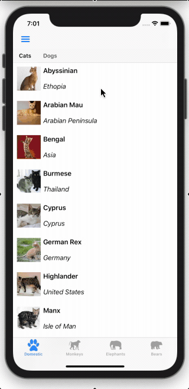
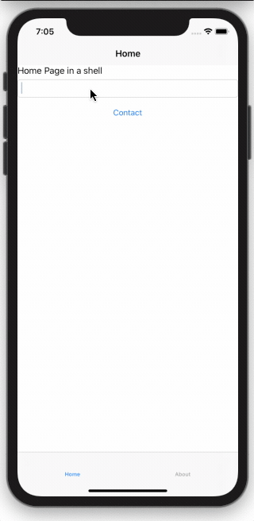

[!INCLUDE [experiment-warning](../includes/experiment-warning.md)]

# Shell Navigation Manager

## Intro
There are several different approaches to navigation within a Xamarin Forms App, including Master/Detail, TabbedPage, Navigation Page and Shell. Any of these approaches can be used in a Mobile Blazor Bindings app but require knowledge of how they are used in Xamarin Forms and haven't been designed with conventions familiar to a Blazor developer in mind.

Shell Navigation Manager is designed to feel familiar for Blazor developers with routes added using the `@page`, accessed via dependency injection and and routes with parameters in the same formats.

Internally it is implemented using Xamarin Forms Shell URI Navigation. Shell has support for top tabs, bottom tabs, hamburger/flyout, stack, modal and Uri based navigation which can all be mixed together or used in isolation, whatever your app needs.



For more details on Shell, check out the [Xamarin Forms documentation](https://docs.microsoft.com/en-us/xamarin/xamarin-forms/app-fundamentals/shell/). Details of routing in Blazor are in the [ASP.NET Core documentation](https://docs.microsoft.com/en-us/aspnet/core/blazor/fundamentals/routing?view=aspnetcore-3.1)

For a sample of ShellNavigationManager see the [Xaminals sample in the Mobile Blazor Bindings repo](https://github.com/xamarin/MobileBlazorBindings/tree/master/samples/MobileBlazorBindingsXaminals).

## Setup
To use the ShellNavigationManager you'll need to have a Shell as the MainPage in your app.

To start off here is a fairly simple Shell which will give us two tabs for a HomePage and an AboutPage. This should be in a file called `AppShell.razor`.

```
<Shell FlyoutBehavior="FlyoutBehavior.Disabled">
    <TabBar>
        <Tab>
            <ShellContent>
                <HomePage />
            </ShellContent>

            <ShellContent>
                <AboutPage />
            </ShellContent>
        </Tab>
    </TabBar>
</Shell>
```


*Note*: The HomePage and AboutPage must have *ContentPage* as their root element to be used in Shell.

Inside App.cs, your AppShell needs to be set as the MainPage of your app. This is done by calling AddComponent. Setting the Shell as the MainPage is done in the background so we also have to set a blank ContentPage as a placeholder while it is loading.

To enable ShellNavigationManager and make it available for our pages we add it as a singleton service.

This should give you an App constructor something along the lines of:

```
public App()
{
    AppHost = MobileBlazorBindingsHost.CreateDefaultBuilder()
        .ConfigureServices((hostContext, services) =>
        {
            // Register app-specific services
            //services.AddSingleton<AppState>();
            services.AddSingleton<ShellNavigationManager>();
        })
        .Build();

    MainPage = new ContentPage();
    AppHost.AddComponent<AppShell>(parent: this);
}
```

## Registering Routes
Route registration occurs in each razor component that you want to be able to navigate to using the `@page` directive followed by a string Uri. This Uri must start with a slash.

For example here's a contact page with the route "/contact".

```
@page "/contact"
<ContentView>
    <StackLayout>
        <Label Text="Phone Number:"></Label>
        <Label Text="123456"></Label>
    </StackLayout>
</ContentView>
```

Multiple routes can be placed on a page if required.

*Note*: At present target pages must have a *ContentView* as their root element. This differs from the *ContentPage* which must be used for children in a Shell.

## Navigating to a page
Navigation between pages is achieved using the Shell Navigation Manager which you can access in your components using the `@inject` directive. Once you have an instance you call NavigateToAsync() with the Uri for the page you want to open.

For example in my HomePage I want to navigate to the `ContactPage`.

```
@inject ShellNavigationManager NavigationManager
<ContentPage>
    <StackLayout>
        <Button Text="Contact" 
                OnClick="OpenContactPage">
        </Button>
    </StackLayout>
</ContentPage>

@code 
{
    async Task OpenContactPage()
    {
        await NavigationManager.NavigateToAsync("/contact");
    }
}
```


## Navigation Parameters
When navigating to a page you will often want to pass data, in Blazor we do this with parameters in the uri.

To set up a page to accept a navigation parameter we need to create a property and mark with a `[Parameter]` attribute.

e.g.
```
[Parameter]
public string Name { get; set; }
```

We also need to add a route for the page with the parameter name, surrounded with `{}` at the end of the `/` separated uri. 

e.g.
```
@page "/contact/{Name}"
```

To navigate, substitute the name you want to pass into the Uri and use the same `NavigateToAsync` function.

e.g.
```
NavigationManager.NavigateToAsync("contact/Dunston");
```



Navigation parameters can be any of various .Net types that can easily be turned into strings including ints, strings, Guids and Dates. Full details of supported types are available in the [Blazor Routing documentation](https://docs.microsoft.com/en-us/aspnet/core/blazor/fundamentals/routing?view=aspnetcore-3.1#route-constraints)
