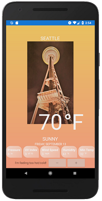

# Weather App

The completed Weather app sample is available [here](https://github.com/xamarin/Emblazon/tree/master/samples/MobileBlazorBindingsWeather). The sample uses a 3rd party Xamarin.Forms component, the `Grid` component, two-way bindings, component initialization logic, dependency injection, CSS styles, and many more features.

The completed app looks like this:

[  ](media/weather-app/weather-app-expanded.png#lightbox)

Rather than write the app from scratch, let's take a look at the key components in this sample application.

1. `Grid` component. The entire UI of the Weather App is contained in the [`MainPage` component](https://github.com/xamarin/Emblazon/blob/master/samples/MobileBlazorBindingsWeather/MobileBlazorBindingsWeather/MainPage.razor), with its main layout established by a `Grid` component.

   * The `Grid` component has two main sections to establish its structure:

        ```xml
        <Grid ...properties...>
            <Layout>
                @* RowDefinitions and ColumnDefinitions *@
            </Layout>
            <Contents>
                @* GridCell components *@
            </Contents>
        </Grid>
        ```

   * The `<Layout>` section defines the `RowDefinition` and `ColumnDefinition` objects that establish the structure of the grid:

        ```xml
        <RowDefinition GridUnitType="GridUnitType.Auto" />
        <RowDefinition GridUnitType="GridUnitType.Star" />
        <RowDefinition GridUnitType="GridUnitType.Auto" />
        <RowDefinition GridUnitType="GridUnitType.Auto" />
        <RowDefinition GridUnitType="GridUnitType.Auto" />
        <RowDefinition GridUnitType="GridUnitType.Auto" />
        <RowDefinition GridUnitType="GridUnitType.Auto" />
        ```

     Learn more about the allowed properties here:

        * [ColumnDefinition](https://docs.microsoft.com/dotnet/api/xamarin.forms.columndefinition?view=xamarin-forms)
        * [RowDefinition](https://docs.microsoft.com/dotnet/api/Xamarin.Forms.RowDefinition?view=xamarin-forms)

   * The `<Contents>` section contains several `<GridCell>` components that can have a `Row`, `Column`, `RowSpan`, and `ColumnSpan` property, and contain a single item representing the cells contents. All of these properties are optional. For example, this `GridCell` will be on row index 6, column index 0, and no row/column span:

        ```xml
        <GridCell Row="6">
            <StackLayout Orientation="StackOrientation.Horizontal"
                        HorizontalOptions="LayoutOptions.Center">
                <Label Text="I'm feeling too hot/cold!"
                        VerticalOptions="LayoutOptions.Center"/>
                <Stepper @bind-Value="Temperature"
                            Minimum="0"
                            Maximum="120"
                            Increment="3"
                            Opacity="0.6"
                            VerticalOptions="LayoutOptions.Center" />
            </StackLayout>
        </GridCell>
        ```

1. A popular 3rd party component often used in Xamarin.Forms apps is the [`PancakeView` component](https://github.com/sthewissen/Xamarin.Forms.PancakeView). The component has been wrapped to enable it to be used with Blazor syntax in a separate class library project: [Microsoft.MobileBlazorBindings.PancakeView](https://github.com/xamarin/Emblazon/tree/master/samples/MobileBlazorBindingsWeather/Microsoft.MobileBlazorBindings.PancakeView). To learn more about how to wrap Xamarin.Forms components for use with Blazor syntax, please read the [Wrapping Xamarin.Forms components for use with Blazor topic](../advanced/custom-components.md).

1. Dependency injection is used in the weather app with a [`WeatherService` type](https://github.com/xamarin/Emblazon/blob/master/samples/MobileBlazorBindingsWeather/MobileBlazorBindingsWeather/WeatherService.cs) that is [registered in the host](https://github.com/xamarin/Emblazon/blob/master/samples/MobileBlazorBindingsWeather/MobileBlazorBindingsWeather/App.cs#L16) and consumed in the [`MainPage.razor` page](https://github.com/xamarin/Emblazon/blob/master/samples/MobileBlazorBindingsWeather/MobileBlazorBindingsWeather/MainPage.razor#L1).

   * To learn more, read the [dependency injection topic](../advanced/dependency-injection.md).

1. Component initialization enables running initialization code when a component is run. The weather app uses this to load the initial weather data when the app starts by overriding the [`OnInitialized` method](https://github.com/xamarin/Emblazon/blob/master/samples/MobileBlazorBindingsWeather/MobileBlazorBindingsWeather/MainPage.razor#L140-L144):

    ```c#
    protected override void OnInitialized()
    {
        CurrentWeather = WeatherService.GetWeatherReport();
        Temperature = CurrentWeather.Temperature;
    }
    ```

   To learn more, including how to do async initialization, check out the [Blazor lifecycle methods documentation](https://docs.microsoft.com/aspnet/core/blazor/lifecycle?view=aspnetcore-3.0).

1. CSS styles are used to apply common properties by element type. A [CSS file](https://github.com/xamarin/Emblazon/blob/master/samples/MobileBlazorBindingsWeather/MobileBlazorBindingsWeather/WeatherStyles.css) is included as an embedded resource in the shared project (this is the default setting for CSS files). A reference to allowed CSS properties is available [here](https://docs.microsoft.com/xamarin/xamarin-forms/user-interface/styles/css/). (Note: Only CSS selectors that reference an element's _type_ are supported (`label { color: red; }`). Id selectors (`#elementId { ... }`) and class selectors (`.className { ... }`) are not yet supported.)
